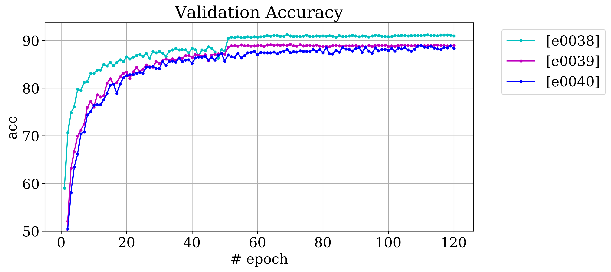
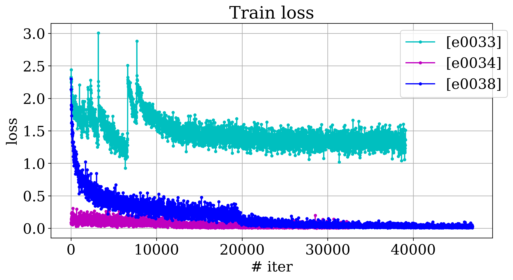
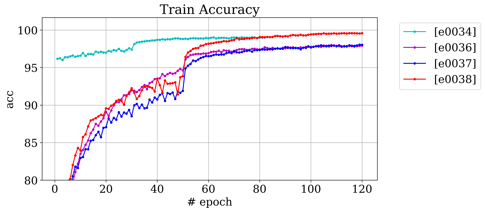
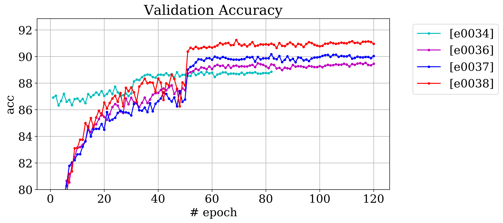
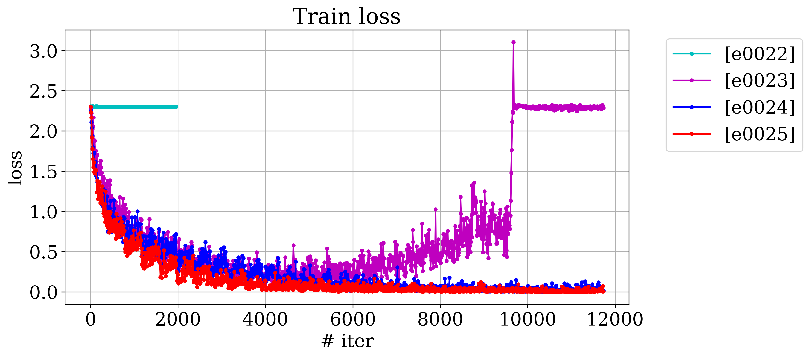
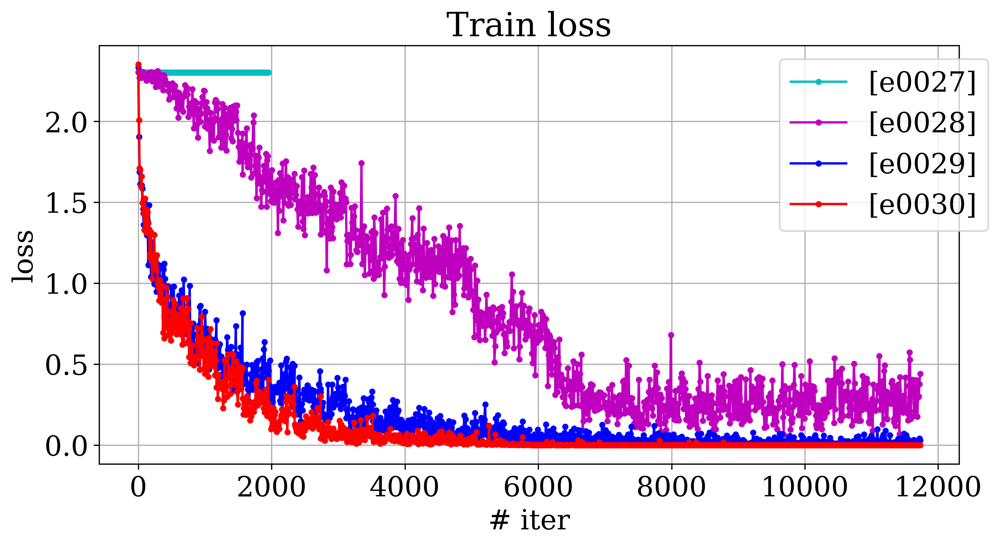
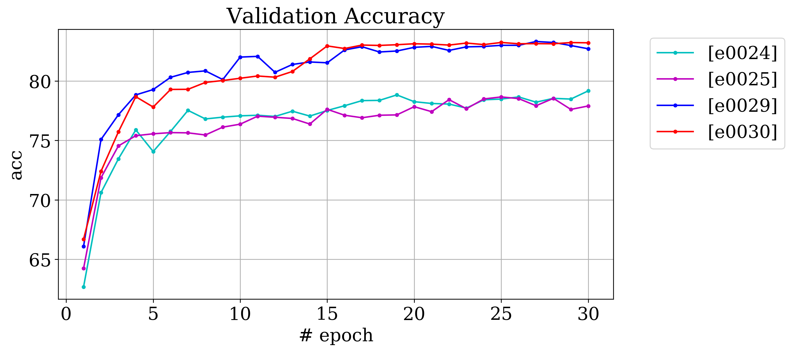
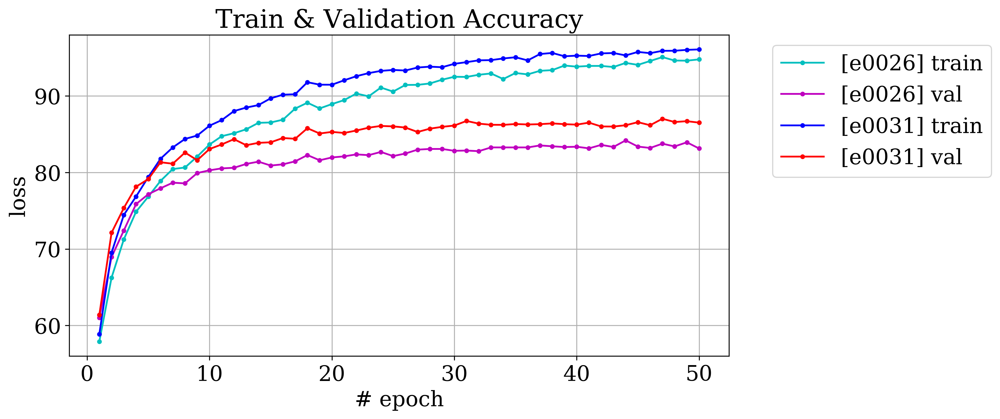

<!--- ###################################################### --->
<!--- 
# [eXXXX] Template

|          |          |
|----------|----------|
|Start Date|2017-07-05|
|End Date  |2017-07-05|
|dataset   |cifar10|
|new       |cont. e0001|

## Results & Deliverables
 
## Interpretation & Conclusion
---> 
<!--- ###################################################### --->

# [e0041-e0043] Transfer Learning

|          |          |
|----------|----------|
|Start Date|2017-07-31|
|End Date  |2017-08-01|
|dataset   |cifar10|

## Motivation

Try pretrained model on imagenet.

## Results & Deliverables & Observation

[accuracy]: 93.49 %
 
## Interpretation & Conclusion

All experiments share setting from [e0038]

| experiments |     diff    | best val. acc. |
|-------------|-------------|----------------|
|e0038        |  (for ref)  |     91.24           |
|e0041        |  pre-trained vgg16, no scheduler                        |     91.61  |
|e0042        |  cont. of e0041, with initial drop 0.001 and scheduler  |     93.49  |
|e0042        |  pre-trained vgg16, scheduler, complex augmentation     |     93.24  |

Observations:

* pre-trained gave the best results so far!
* still 'simple' augmentation wins 

<!--- ###################################################### --->

# [e0039, e0040] Adam (second try)

|          |          |
|----------|----------|
|Start Date|2017-07-25|
|End Date  |2017-07-26|
|dataset   |cifar10|

## Motivation

Try adam again (with best settings from the previous experiment [e0038])

 
## Interpretation & Conclusion

All experiments share setting from [e0038]

| experiments |     diff    | best val. acc. |
|-------------|-------------|----------------|
|e0039        |  with scheduler |     89.17  |
|e0040        |  no scheduler   |     88.88  |

Observations:

* adam is worse than sgd
* scheduler helps in this case (wat unexpected) 

<!--- ###################################################### --->

# [e0033-e0034, e0036-e0038] make best of VGG

|          |          |
|----------|----------|
|Start Date|2017-07-22|
|End Date  |2017-07-24|
|dataset   |cifar10|

## Motivation

To get as much as possible in terms of accuracy on vgg net, 
playing with learning schedule (optim.lr_scheduler.StepLR) and other parameters.

## Results & Deliverables & Observation

[time per epoch]: ~ 3 min
[accuracy]: 91.24 %
  
 
## Interpretation & Conclusion

All experiments share the following:
* NET MODEL: VGG_BN_3x32x32
* optim.lr_scheduler.StepLR
* lr_schedule_gamma: 0.1

| experiments |     diff    | best val. acc. |
|-------------|-------------|----------------|
|e0033        |  lr: 0.1 |                                                                     57.62 |
|e0034        |  lr: 0.01; weights: experiments/logs/e0031_model_best.pth  |                   88.85 |
|e0036        |  Normalize(mean=[0.4914, 0.4822, 0.4465], std=[0.2023, 0.1994, 0.201];  |      89.52 |
|e0037        |  the same setting as e0036; weight_decay: 0.0005 |                             90.17 |
|e0038        |  the same setting as e0037; train: augment_simple |                            91.24 |

 
 

Observations:

* high init lr has bad consequences on training (e0033);
* normalization coefficients are important;
* weight_decay plays a role;
* simple augmentation is better than more complex one;

<!--- ###################################################### --->

# [e0032] 3 additional FC layers for VGG

|          |          |
|----------|----------|
|Start Date|2017-07-21|
|End Date  |2017-07-21|
|dataset   |cifar10|
|history   |linked to e0031, e0026 experiments|

## Motivation

To check the vgg model with additional 3 fc layers.
As it is in the original vgg model (designed for ImageNet data).
Such structure was present in my early experiments (e0022-e0026).
In these experiment (e0022-e0026) RELU activation was missing in conv. layers part. 
In contrast the next series of experiments (e0027-e0031) were carried out with RELU, 
but with only one fc layer. The last series of experiments shown superior performance.  

The idea is to clarify whether 3 additional fc layers give some improvement in comparison
with one fc layer. 

## Results & Deliverables & Observation

[time per epoch]: ~ 3 min
[accuracy]: 86.81 %
 
 
## Interpretation & Conclusion

| experiments |     diff    |
|-------------|-------------|
|e0026        | no RELU on conv part, 3 FC layers    |               
|e0031        | with RELU on conv part, 1 FC layers  | 
|e0032        | with RELU on conv part, 3 FC layers  |

Observations:

* no improvement;
* average training time per epoch is the same 1 FC variant;

<!--- ###################################################### --->

# [e0022-e0031] VGG + init + batch_normalization

|          |          |
|----------|----------|
|Start Date|2017-07-14|
|End Date  |2017-07-17|
|dataset   |cifar10|
|history   |new|

## Motivation

* Try more complicated architecture. Prior to these experiments everything was done on lenet-like architecture.
* Try several initialization methods
* Try batch normalization (BN) and compare VGG models with and without BN.

## Results & Deliverables
 
time during training: 3 min per epoch
accuracy (val set): 87.02 % 
 
## Interpretation & Conclusion

model 1: VGG, on conv layers no RELU, 3 fc layers
model 2: VGG, conv layers with RELU, 1 fc layer

| experiments |     diff    |
|-------------|-------------|
|e0022        | model 1, default init |
|e0023        | model 1, resnet init   |
|e0024        | model 1 + BN, default init  |
|e0025        | model 1 + BN, resnet init  |
|e0026        | model 1 + BN, resnet init, augmentation  |
|e0027        | model 2, default init |                     
|e0028        | model 2, resnet init   |                    
|e0029        | model 2 + BN, default init  |               
|e0030        | model 2 + BN, resnet init  |                
|e0031        | model 2 + BN, resnet init, augmentation  |  

* Init effect on net without BN + model_1 with and without BN

* Init effect on net with BN + comparison model_1 and model_2

* comparison model_1 and model_2 : augmentation + long

<!--- ###################################################### --->

# [e0020] Tiny subset

|          |          |
|----------|----------|
|Start Date|2017-07-09|
|End Date  |2017-07-09|
|dataset   |cifar10|
|history   |new|

## Motivation

Train tiny subset (overfit it).

## Results & Deliverables
 
time: 40 s
accuracy: 100 % 
 
## Interpretation & Conclusion

**weirdness:**:
 
* training behavior at 140-150 epochs

<!--- ###################################################### --->

# [e0019] With augmentation

|          |          |
|----------|----------|
|Start Date|2017-07-09|
|End Date  |2017-07-09|
|dataset   |cifar10|
|history   |new|

## Motivation

First attempt with augmentatin.

## Results & Deliverables
 
## Interpretation & Conclusion

| experiments |     diff    |
|-------------|-------------|
|e0017        |             |
|e0019        | augmented   |

'transforms.Compose([
transforms.RandomApply([transforms.ColorJitter(brightness=.3,  contrast=.1,  saturation=.2, hue=.2)], p=0.5),
transforms.RandomHorizontalFlip(p=0.6),
transforms.RandomApply([transforms.RandomRotation(30)], p=0.3),
transforms.ToTensor(),
transforms.Normalize(mean=im_mean, std=im_std)
])'

**observations:**

* with *batch_size=256* training starts to slow down. May be it is also an issue of learning rate. 

* sweet spot is seems to be *batch_size=128* 

<!--- ###################################################### --->

# [e0015-e0018] LeNet-like model with different batch_size

|          |          |
|----------|----------|
|Start Date|2017-07-08|
|End Date  |2017-07-08|
|dataset   |cifar10|
|history   |new|

## Motivation

To compare training with different batch sizes

## Results & Deliverables
 
## Interpretation & Conclusion

| experiments |     diff    |
|-------------|-------------|
|e0015        | batch_size = 32   |
|e0016        | batch_size = 64   |
|e0017        | batch_size = 128  |
|e0018        | batch_size = 256  |

Below are the learning curves for accuracy & loss on validation set.
The training set results are boring (everything is decreasing).

**observations:**

* with *batch_size=256* training starts to slow down. May be it is also an issue of learning rate. 

* sweet spot is seems to be *batch_size=128* 

<!--- ###################################################### --->

# [e0012-e0014] LeNet-like model with different optimizers

|          |          |
|----------|----------|
|Start Date|2017-07-06|
|End Date  |2017-07-06|
|dataset   |cifar10|
|history   |new|

## Motivation

To compare different optimizers (sgd, adam, rms_prop)

## Results & Deliverables
 
## Interpretation & Conclusion

| experiments |     diff    |
|-------------|-------------|
|e0012        | sgd (lr=0.01, momentum=0.9)  |
|e0013        | adam (default)               |
|e0014        | rms_prop (default)           |

Below are the learning curves for accuracy & loss on validation set.
The training set results are boring (everything is decreasing).

**observations:**

* *adam* in this settings is not different than *sgd*. 

*  *rms_prop* is not good at all!

<!--- ###################################################### --->

# [e0005-e0011] LeNet-like model with different learning rates

|          |          |
|----------|----------|
|Start Date|2017-07-05|
|End Date  |2017-07-05|
|dataset   |cifar10|
|new       |cont. e0002|

## Motivation

To play with different learning rates and find the optimal one.

## Results & Deliverables
 
## Interpretation & Conclusion

| experiments |     diff    |
|-------------|-------------|
|e0002        | lr = 0.001  |
|e0005        | lr = 0.003  |
|e0006        | lr = 0.006  |
|e0007        | lr = 0.009  |
|e0008        | lr = 0.01   |
|e0009        | lr = 0.012  |
|e0010        | lr = 0.0008 |
|e0011        | lr = 0.0005 |

Below are the learning curves for accuracy & loss on validation set.
The training set results are boring (everything is decreasing).

**observations:**

* the optimal lr is ~0.1 and 20 epoch is enough 

<!--- ###################################################### --->

# [e0002-e0004] LeNet-like model with different number of epochs

|          |          |
|----------|----------|
|Start Date|2017-07-05|
|End Date  |2017-07-05|
|dataset   |cifar10|
|new       |cont. e0001|

## Motivation

* To extend the training period to larger epochs.
* To 'repeat' the experiment with the same parameters (as in e0001) 
and compare.
* Test load from checkpoint functionality.

This *baseline* can serve as a starting point for further investigations 
(different learning rates, different initialization, different optimizations)
on this model.   

## Results & Deliverables

Accuracy [val]: 66.22 %

## Interpretation & Conclusion 

| experiments |     diff |
|-------------|----------|
|e0001        |#epochs = 30|
|e0002        |#epochs = 50|
|e0003        |#epochs = 80|
|e0004        |#epochs = 80, start from e0002 checkpoint|

**observations:**

* validation accuracy starts to saturate around 40 epoch.
* validation loss starts to degradate around 50 epoch.
At this point there is a clear sign of over-fitting. 
* different experiments are consistent.
* load from checkpoint works fine.

For further investigation the #epoch = 50 seems the most reasonable. 

**weirdness:**:

* After 50 epoch the validation loss increase, but the validation accuracy is the same.

<!--- ###################################################### --->

# [e0001] Training LeNet-like model on cifar-10 dataset

|Start Date|End Date  |
|----------|----------|
|2017-07-01|2017-07-01|

## Motivation

The goal here is to train simple model on cifar10 dataset without gpu support.

## Description

Training time [cpu]: ~ 20 min. (30 epochs)

Accuracy [val]: 62 %

## Deliverables

- [x] updated notebook
  - `/notebook/expr_analysis.py`
  
## Interpretation

As we can see on the plot, 

validation accuracy starts to saturate around 22 epoch, 
suggesting that we have exploited all capacity of this simple model.  

On the other hand the loss is still decreasing, 
suggesting to run other experiment with this model for more epoch.

## Conclusion

It seems that more powerful model is needed. 

<!--- ###################################################### ---> 
